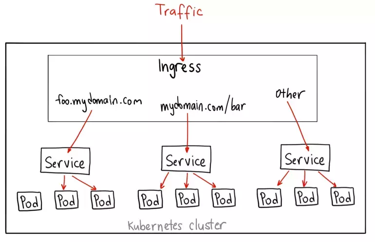
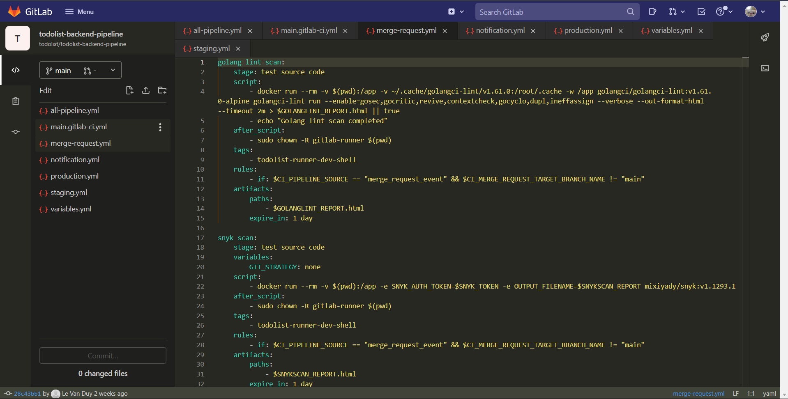
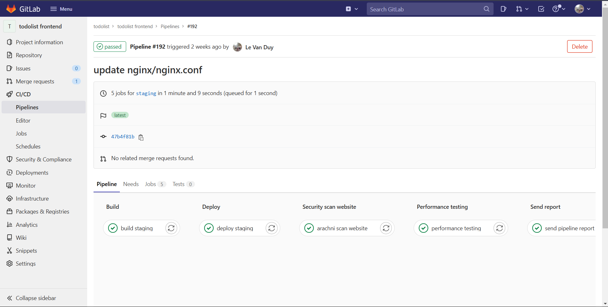
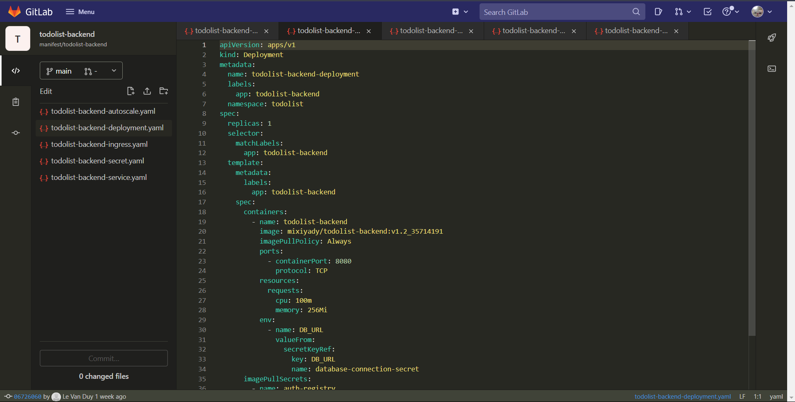
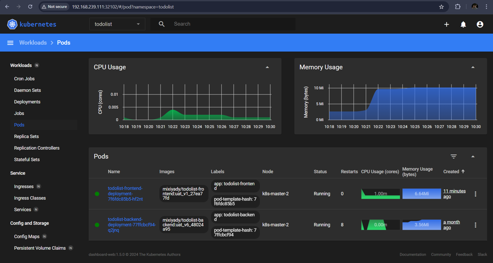
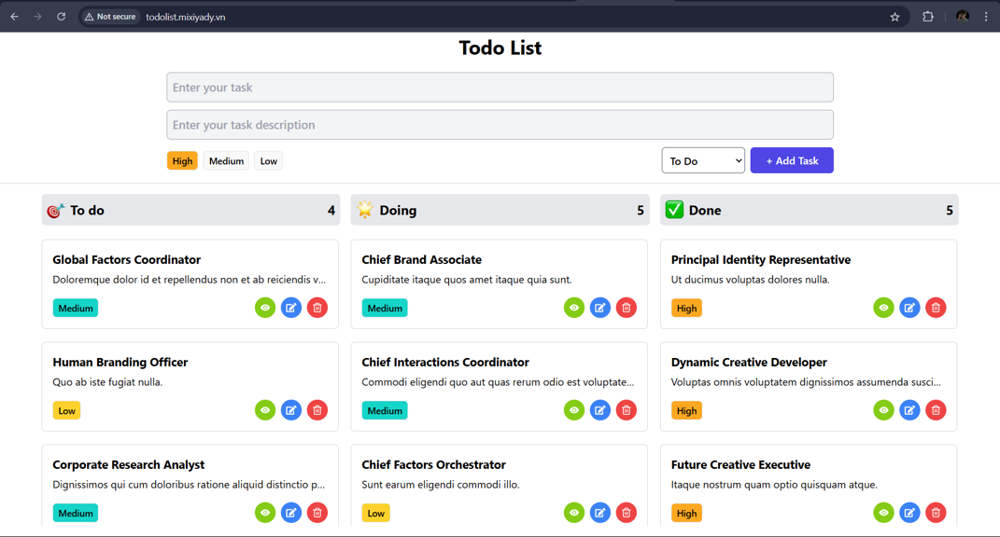

# CI/CD Pipeline Devsecops Docker GitLab Kubernetes

---

This project is a demonstration of a CI/CD pipeline with DevSecOps practices. It includes backend and frontend components for a ToDo list application, along with infrastructure and pipeline configurations.

## **CI/CD Pipeline Devsecops Overview Diagram**

The CI/CD pipeline is designed to integrate DevSecOps practices, ensuring that security is embedded throughout the development and deployment process. The pipeline includes stages for code linting, building, security scanning, deploying, and performance testing. It leverages tools like Snyk for vulnerability scanning, Arachni for web application security scanning, and k6 for performance testing.

## **Infrastructure Demo Diagram**

The infrastructure for this project utilizes VMware Workstation to run all virtual machines. The setup includes:

-   **GitLab Server**: Hosts the Git repository and CI/CD pipelines.
-   **Development and Staging Servers**:
    -   Both servers are configured with Docker and GitLab Runners for run jobs from pipeline.
    -   The **Dev Server** handles initial image building and testing.
    -   The **Staging Server** is used for user acceptance testing (UAT) with database connections for integrated tests.
-   **Docker Hub**: Serves as the central image registry for Docker containers created during the pipeline stages.
-   **Kubernetes Cluster**:
    -   A 3-node cluster running on Ubuntu virtual machines. All nodes act as masters and participate in load balancing.
    -   Managed with **Argo CD** for GitOps deployments and **Kubernetes Dashboard** for monitoring and resource management.
    -   Includes an **ingress controller** to route external traffic to the appropriate service pods based on URL paths or subdomains. For example:
        -   Requests to `todolist.mixiyady.com` go to the service managing "todolist-frontend" pods.
            
    -   The load balancer ensures high availability across the three master nodes.
-   **Ingress Controller**: Facilitates smooth traffic routing from the internet to services in the cluster by exposing application services via a single public entry point.

This infrastructure setup allows for a scalable, containerized deployment of the application, with the Kubernetes cluster providing orchestration and load balancing capabilities. The use of GitOps and Argo CD ensures that the application state is kept in sync with the Git repository, enabling reliable and consistent deployments.

## **CI/CD Pipeline Flow Diagram**

The CI/CD pipeline flow follows a Git flow branching strategy. Feature branches are created for new features and bug fixes. Merge requests trigger the CI/CD pipeline, which includes stages for building, testing, and deploying the application. The pipeline ensures that only code that passes all checks is merged into the main branch and deployed to production.

More details about the GitLab CI/CD config: [GitLab CI Config](https://github.com/LeDuy0806/CI-CD-Pipeline-Devsecops-GitlabCi-Kubernetes/tree/main/Demo/GitLabCI)

### Git Flow and Key Branches

-   **Main**: The main branch of the project, containing the source code that has been tested and is ready for production deployment. All changes to the main branch are managed through tags to mark versions. Only the final jobs, including DAST, performance testing, and image deployment to production, are run.
-   **Staging**: An intermediate branch where integration testing is performed before merging to the main branch. The code here is built and deployed to the staging environment. After an MR is merged into staging, all jobs including image build, image scan, image deployment, DAST, and performance testing are executed to ensure the code is ready for production.
-   **Develop**: The branch for focused development, consolidating code from feature branches before moving to staging. This is where continuous integration is performed.
-   **Feature Branches (feature/[name])**: Branches created from develop, each focusing on developing a new feature or fixing a bug. After completion, these branches are merged into develop through a Merge Request (MR). SAST and SCA jobs may be run regularly to ensure the code is secure and has no vulnerabilities.

### CI/CD Pipeline

#### 1. Merge Request Pipeline

The pipeline runs when a Merge Request (MR) is created, with two main cases:

-   **MR between feature branches**:
    -   Step 1: SAST (Static Application Security Testing)
        -   Statically analyze the source code using tools like eslint and gocli lint.
        -   The reports are stored and sent via Telegram.
    -   Step 2: SCA (Software Composition Analysis)
        -   Analyze third-party libraries using Snyk.
    -   Step 3: Send Reports
        -   All reports from the previous steps are sent via Telegram for notification.
-   **MR from feature to develop**:
    -   Step 1: SAST
    -   Step 2: SCA
    -   Step 3: Build Image
        -   Build a Docker image with a special tag for the MR.
    -   Step 4: Security Scan Image
        -   Scan the Docker image for vulnerabilities using Trivy.
    -   Step 5: Send Reports
-   **MR from develop or staging**:
    -   The process is similar, but the build and scan stages are more thorough to ensure stability.

#### 2. Pipeline on the `develop` branch

-   Step 1: Build and push the Docker image to the registry.
-   Step 2: Deploy the Docker container to the development testing environment.
-   Step 3: Send the report via Telegram after completion.

#### 3. Pipeline on the `staging` branch

-   Step 1: Build Staging Image
    -   Build a Docker image from the staging branch with a specific identifier tag.
    -   The tag is stored in a GitLab CI/CD variable for reuse.
-   Step 2: Deploy Staging
    -   Deploy the image to the staging environment.
    -   The container runs with environment variables specific to staging.
-   Step 3: Scan Website Security
    -   Use Arachni to check for security vulnerabilities on the web application.
-   Step 4: Performance Testing
    -   Run performance (smoke) tests using k6.
-   Step 5: Send Reports
    -   All security and performance reports are sent via Telegram for monitoring.

#### 4. Pipeline on the `main` (Production) branch

-   Step 1: Build Production Image
    -   Build a Docker image based on the staging image, then re tag and push it to the registry.
-   Step 2: Deploy Production
    -   Update the deployment manifest in the dedicated production environment repository.
    -   Deploy the application through the Kubernetes process, ensuring the application always runs with the latest image.
-   Step 3: Send Reports
    -   Notify about the production deployment via Telegram, including information about the pipeline, commit, and tag.

---

## Folder Structure

The demo project includes the following components :

[FE BE Code](https://github.com/LeDuy0806/CI-CD-Pipeline-Devsecops-GitlabCi-Kubernetes/tree/main/Demo/Code)

### Backend

The backend for the ToDo list application is located in the `Code/todolist-be` directory.

### Frontend

The frontend for the ToDo list application is located in the `Code/todolist-fe` directory.

### Database

The database configuration is located in the `Code` directory and includes:

-   `mysql.docker-compose.yaml`: Docker Compose configuration for MySQL.
-   `table_data_init.sql`: SQL script to initialize the database tables and data.

### CI/CD Pipelines

The CI/CD pipelines are configured using GitLab CI: [GitLab CI Config](https://github.com/LeDuy0806/CI-CD-Pipeline-Devsecops-GitlabCi-Kubernetes/tree/main/Demo/GitLabCI)

-   `GitLabCI/todolist-backend-pipeline/`: GitLab CI pipeline configuration for the backend.
-   `GitLabCI/todolist-frontend-pipeline/`: GitLab CI pipeline configuration for the frontend.

### Kubernetes

Kubernetes configurations are located in the `Kubernetes` directory and include: [Kubernetes manifest file](https://github.com/LeDuy0806/CI-CD-Pipeline-Devsecops-GitlabCi-Kubernetes/tree/main/Demo/Kubernetes)

-   `Kubernetes/todolist-backend/`: Kubernetes configurations for the backend.
-   `Kubernetes/todolist-frontend/`: Kubernetes configurations for the frontend.

---

## Results of the Project:

-   **Gitlab CI Config repo**:
    
-   **Pipeline run successfully**:
    
-   **Kubernetes manifest repo**:
    
-   **Kubernetes Dashboard Monitoring App**:
    
-   **ArgoCD**:
    
-   **Front-end app deployed on Kubernetes**:
    
