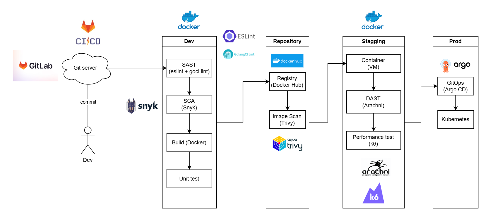
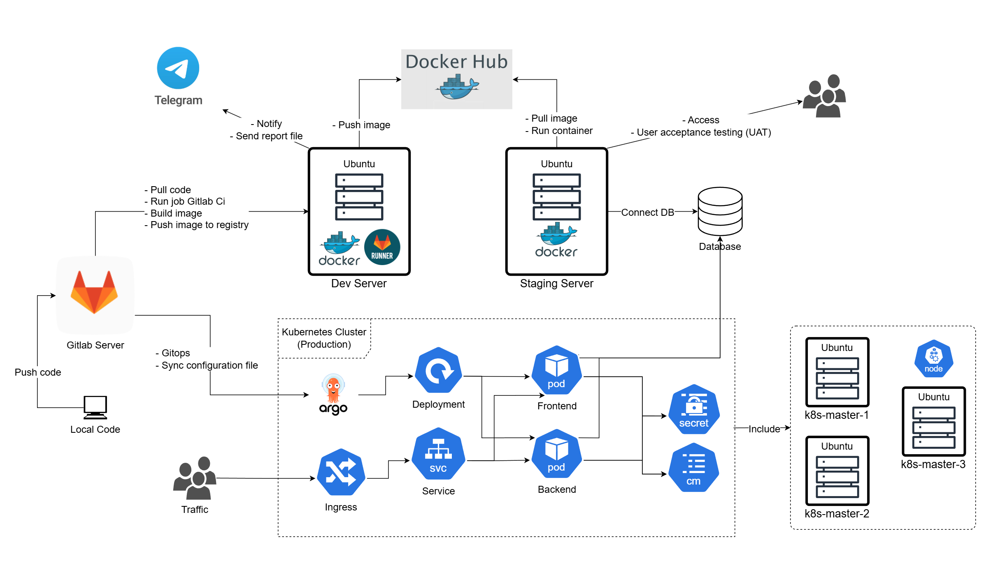
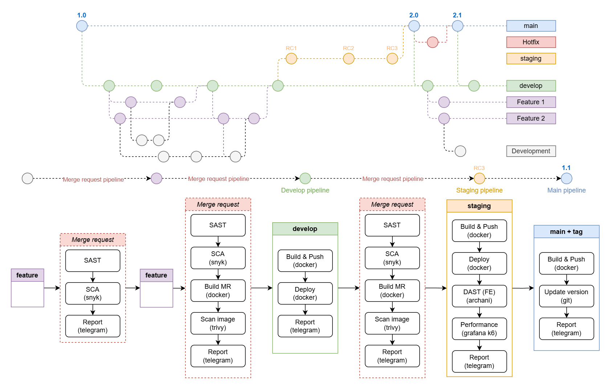

This project is a demonstration of a CI/CD pipeline with DevSecOps practices. It includes backend and frontend components for a ToDo list application, along with infrastructure and pipeline configurations.

**CI/CD Pipeline Devsecops Diagram:**

The CI/CD pipeline is designed to integrate DevSecOps practices, ensuring that security is embedded throughout the development and deployment process. The pipeline includes stages for code linting, building, security scanning, deploying, and performance testing. It leverages tools like Snyk for vulnerability scanning, Arachni for web application security scanning, and k6 for performance testing.

**Infrastructure Demo Diagram:**

The infrastructure for the application is containerized using Docker and orchestrated using Kubernetes. The backend and frontend services are deployed as separate pods within a Kubernetes cluster. The database is set up using a MySQL container. The infrastructure is designed to be scalable and resilient, with configurations for load balancing and auto-scaling.

**CI/CD Pipeline Flow Diagram:**

The CI/CD pipeline flow follows a Git flow branching strategy. Feature branches are created for new features and bug fixes. Merge requests trigger the CI/CD pipeline, which includes stages for building, testing, and deploying the application. The pipeline ensures that only code that passes all checks is merged into the main branch and deployed to production.

---

The demo project includes the following components:

## Backend

The backend for the ToDo list application is located in the `todolist-be` directory.

## Frontend

The frontend for the ToDo list application is located in the `todolist-fe` directory.

## Database

The database configuration is located in the `Code` directory and includes:

-   `mysql.docker-compose.yaml`: Docker Compose configuration for MySQL.
-   `table_data_init.sql`: SQL script to initialize the database tables and data.

## CI/CD Pipelines

The CI/CD pipelines are configured using GitLab CI and Jenkins:

-   `GitLabCI/todolist-backend-pipeline/`: GitLab CI pipeline configuration for the backend.
-   `GitLabCI/todolist-frontend-pipeline/`: GitLab CI pipeline configuration for the frontend.

## Kubernetes

Kubernetes configurations are located in the `Kubernetes` directory and include:

-   `todolist-backend-main/`: Kubernetes configurations for the backend.
-   `todolist-frontend-main/`: Kubernetes configurations for the frontend.

## Documentation

Additional documentation is available in the `Documents` directory.

## Reports

Reports and presentations are available in the `Reports` directory, including:

-   `SE400.P11.PMCL_21521997_LeVanDuy_Slide.pptx`: Project presentation slides.
